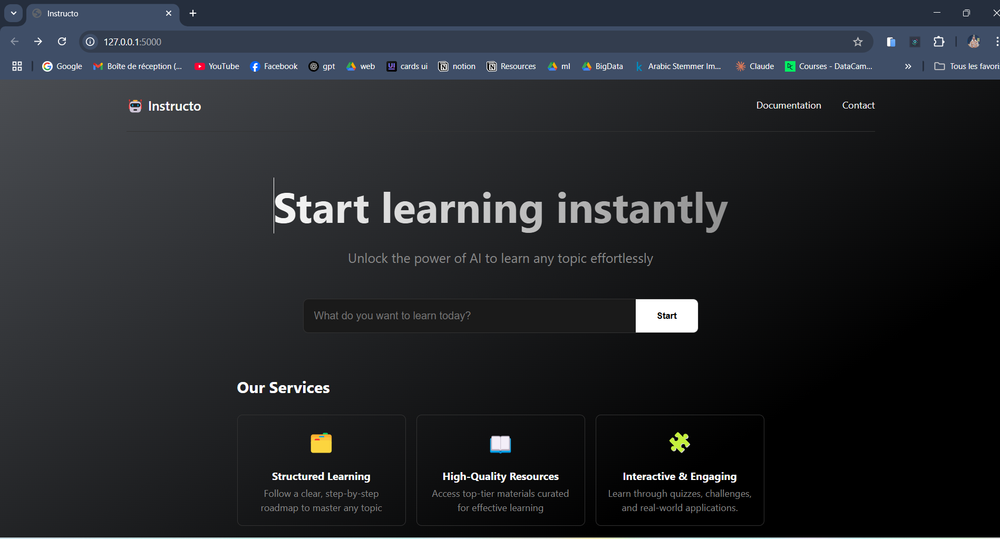

# AI Mentor Agents  

## 🚀 Overview  
**AI Mentor Agents** is an AI-powered application that helps you learn any topic efficiently through structured knowledge bases, personalized learning roadmaps, curated resources, and interactive exercises.  

## 🔧 Features  
- 📚 **Structured Knowledge Bases** – Comprehensive, well-organized insights on any subject.  
- 🎓 **Learning Roadmaps** – Step-by-step guides from beginner to expert.  
- 🔎 **Curated Resources** – High-quality books, tutorials, and references.  
- 📝 **Interactive Exercises** – Quizzes and practice problems for hands-on learning.  

## 🛠 Tech Stack  
- **Flask** – Backend framework.  
- **Gemini AI** – Pre-trained LLM for intelligent responses.  
- **CrewAI** – For agent-based AI interactions.  
- **Serper Dev** – For web scraping and resource curation.  

## 📸 Screenshots  
  

## 🚀 Installation  
Follow these steps to set up the project locally:  

```bash
# Clone the repository
git clone https://github.com/OussamaBenSlama/Ai-mentor-agents  
cd Ai-mentor-agents  

# Create and activate a virtual environment
python -m venv .venv  
.venv\Scripts\activate

# Install dependencies
pip install -r requirements.txt  

# Run the application
python app.py  
